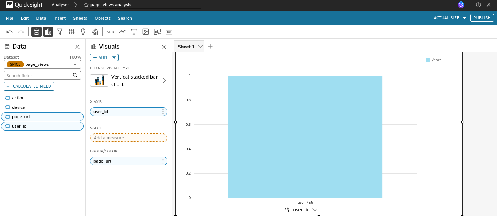

# AWS Real-Time Analytics Pipeline

A **serverless**, real-time data analytics pipeline on AWS to process and visualize website clickstream data. Built with 100% serverless AWS services to ensure minimal cost, automatic scaling, and zero server management.

## Architecture


The pipeline is built using the following **serverless** AWS services:
*   **Data Ingestion:** Amazon Kinesis Data Streams
*   **Data Processing:** AWS Lambda
*   **Data Storage:** Amazon S3
*   **Data Querying:** Amazon Athena
*   **Data Visualization:** Amazon QuickSight
*   **Infrastructure as Code:** AWS CDK (Python)

## Features
*   **Fully Serverless Architecture:** No servers to manage; scales automatically with workload
*   **Real-time Processing:** Sub-60 second end-to-end data latency
*   **Infrastructure as Code:** Entire environment defined and deployed via AWS CDK for guaranteed reproducibility
*   **Cost-Effective:** Pay-per-use pricing model for maximum efficiency
*   **Interactive Analytics:** Amazon QuickSight dashboards for business intelligence

## Deployment

1.  Clone the repository:
    ```bash
    git clone https://github.com/odescopi/aws-real-time-analytics-pipeline.git
    cd aws-real-time-analytics-pipeline
    ```

2.  Install dependencies:
    ```bash
    python -m venv .venv
    source .venv/bin/activate
    pip install -r requirements.txt
    ```

3.  Deploy the stack:
    ```bash
    cdk deploy
    ```

## Dashboard

The pipeline powers an interactive Amazon QuickSight dashboard:


## License

This project is licensed under the MIT License - see the [LICENSE](LICENSE) file for details.
=======


